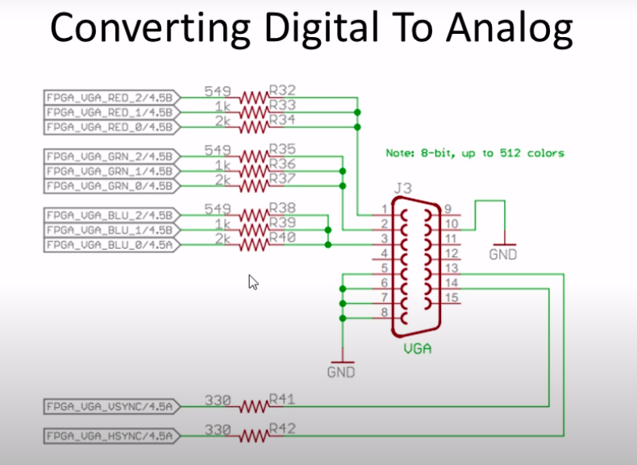

# vga_interface_with_FPGA
Interfacing Tang primer with VGA display.

## Table of Content:
 - [Getting Started With Tang Primer](#getting-started-With-tang-primer)
 - [File Structure](#file_structure)
 - [IO info](#io-info)
 - [Circuit Diagram](#circuit-diagram)
 - [TO DO](#to-do)
 - [Reference](#refernce)

## Getting Started With Tang Primer:
- [Install The TD IDE](https://tang.sipeed.com/en/getting-started/)
- [Tang FPGA Examples](https://github.com/Lichee-Pi/Tang_FPGA_Examples)
- [Tang Primer GPIO and Project Info](https://tang.sipeed.com/en/using-tang/using-gpio/)

## File Structure: 


    ├── constraint
    │   └── io.adc
    ├── prj
    │   ├── simulation
    │   ├── td_2021-01-30_22-28-34.log
    │   ├── td_2021-01-31_17-46-24.log
    │   ├── td_2021-02-02_21-38-20.log
    │   ├── td_2021-02-02_21-38-33.log
    │   ├── vga_test_pattern.al
    │   ├── vga_test_pattern.bit
    │   ├── vga_test_pattern_gate.area
    │   ├── vga_test_pattern_gate.db
    │   ├── vga_test_pattern_phy.area
    │   ├── vga_test_pattern_pr.db
    │   ├── vga_test_pattern_rtl.area
    │   └── vga_test_pattern_rtl.db
    ├── README.md
    └── src
        ├── a.out            //Iverilog Output
        ├── a.vcd            //GTKWave Output
        ├── sync_count.v     //Produces count value from sync signals
        ├── testbench.v      //TestBench to test top module
        ├── test_pattern_gen.v //Test pattern Generator
        ├── vga_sync_porch.v   //Module to add porch in sync signals
        ├── vga_sync_pulse.v   //sync pulse produce using clock
        └── vga_test_pattern_top.v //Top module with pll

## IO info:       
```
#System Clock
set_pin_assignment	{ i_clk }	{ LOCATION = K14; IOSTANDARD = LVCMOS33; }

#VGA Clock
set_pin_assignment	{ o_VGA_CLK }	{ LOCATION = P5; }

#VGA Control Signals
set_pin_assignment	{ o_VGA_vsync }	{ LOCATION = C16; IOSTANDARD = LVCMOS33; DRIVESTRENGTH = 20; }
set_pin_assignment	{ o_VGA_hsync }	{ LOCATION = B16; IOSTANDARD = LVCMOS33; DRIVESTRENGTH = 20; }

#VGA Red
set_pin_assignment	{ o_VGA_red_0 }	{ LOCATION = C5; IOSTANDARD = LVCMOS33; DRIVESTRENGTH = 20; }
set_pin_assignment	{ o_VGA_red_1 }	{ LOCATION = A3; IOSTANDARD = LVCMOS33; DRIVESTRENGTH = 20; }
set_pin_assignment	{ o_VGA_red_2 }	{ LOCATION = A4; IOSTANDARD = LVCMOS33; DRIVESTRENGTH = 20; }

#VGA Green
set_pin_assignment	{ o_VGA_green_0 }	{ LOCATION = B10; IOSTANDARD = LVCMOS33; DRIVESTRENGTH = 20; }
set_pin_assignment	{ o_VGA_green_1 }	{ LOCATION = C9; IOSTANDARD = LVCMOS33; DRIVESTRENGTH = 20; }
set_pin_assignment	{ o_VGA_green_2 }	{ LOCATION = B6; IOSTANDARD = LVCMOS33; DRIVESTRENGTH = 20; }

#VGA Blue
set_pin_assignment	{ o_VGA_blue_0 }	{ LOCATION = B15; IOSTANDARD = LVCMOS33; DRIVESTRENGTH = 20; }
set_pin_assignment	{ o_VGA_blue_1 }	{ LOCATION = A14; IOSTANDARD = LVCMOS33; DRIVESTRENGTH = 20; }
set_pin_assignment	{ o_VGA_blue_2 }	{ LOCATION = B14; IOSTANDARD = LVCMOS33; DRIVESTRENGTH = 20; }

#Pattern Select
set_pin_assignment	{ sel0 }	{ LOCATION = T7; }
set_pin_assignment	{ sel1 }	{ LOCATION = R7; }
```
## Circuit Diagram:

<p align="center">
    
</p>

## TO DO:

 - Pong Game


## Reference:

- [Nandland Tutorials](https://www.nandland.com/goboard/vga-introduction-test-patterns.html)
- [piotr-go Repo](https://github.com/piotr-go/Lichee-Tang)